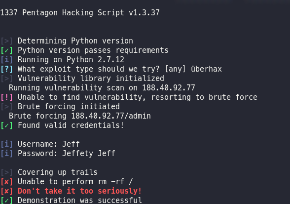

# Command Line Tools

## Purpose

This collection aims to provide out of the box solutions for 
python applications without a graphical user interface. 

## How to install

Coming soon, until then `git clone` and `import` from your application

## Demo

Clone the repo, and run `python test_output.py` inside the folder. 

## Contribute

Bugs, performance optimizations, etc are welcome. 
Create a PR for your improvements, or an issue if you're having problems.